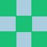

Grobber
=======

Image generator based on a string value

# Install

    gem install grobber
    
or in your Gemfile:

    gem 'grobber'

## How to use

    grobber = Grobber::Image.new('some text string')
    grobber.write('foo.jpg')

Grobber will always render the same image for the same string. 

